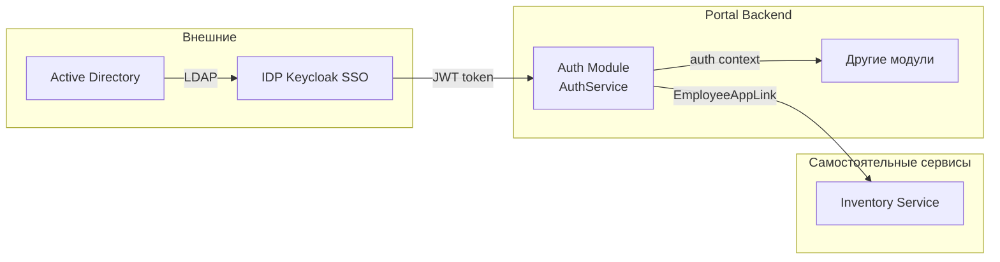
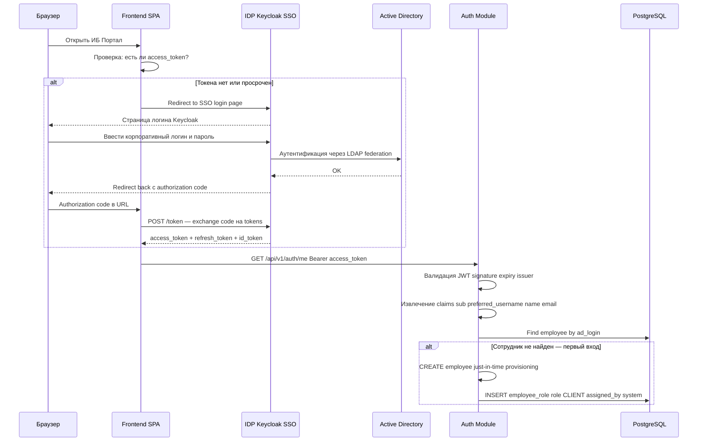
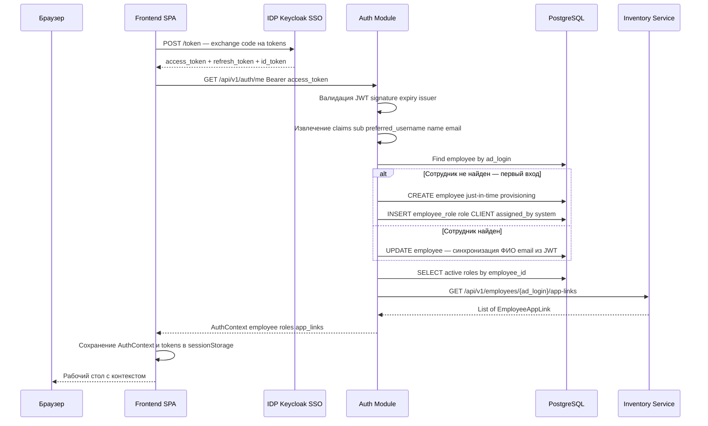

# Auth Module — текстовая расшифровка диаграмм (ТЗ)

Ниже приведена расшифровка диаграмм с фото в текстовом виде.

Источник: wiki Auth Module — CyberSecurity (`bwiki.beeline.ru/spaces/CYB/pages/1932719359/Auth+Module`).

---

## 2. Контекст в архитектуре

Публичный интерфейс модуля — **AuthService**. Модуль следует принципам модульности: явные границы, данные принадлежат модулю, готовность к выделению.

### Группы и компоненты

| Группа | Компонент | Описание |
|---|---|---|
| **Внешние** | Active Directory | Корпоративный каталог пользователей |
| **Внешние** | IDP Keycloak SSO | Identity Provider, SSO-вход |
| **Portal Backend** | Auth Module (AuthService) | Аутентификация, JIT-provisioning, контекст пользователя |
| **Portal Backend** | Другие модули | Потребители auth context |
| **Самостоятельные сервисы** | Inventory Service | Ссылки на приложения сотрудника |

### Потоки данных

| От | К | Протокол / данные |
|---|---|---|
| Active Directory | IDP Keycloak SSO | LDAP (federation) |
| IDP Keycloak SSO | Auth Module (AuthService) | JWT token |
| Auth Module (AuthService) | Другие модули | auth context |
| Auth Module (AuthService) | Inventory Service | EmployeeAppLink |

### Mermaid — контекстная диаграмма

---

## 3. Доменная модель

### `EMPLOYEE`

| Тип | Поле |
|---|---|
| `uuid` | `id` |
| `string` | `ad_login` |
| `string` | `full_name` |
| `string` | `email` |
| `string` | `personnel_number` |
| `timestamp` | `created_at` |
| `timestamp` | `updated_at` |

### `ROLE`

| Тип | Поле |
|---|---|
| `uuid` | `id` |
| `string` | `code` |
| `string` | `name` |
| `string` | `description` |

### `EMPLOYEE_ROLE`

| Тип | Поле |
|---|---|
| `uuid` | `id` |
| `uuid` | `employee_id` |
| `uuid` | `role_id` |
| `timestamp` | `assigned_at` |
| `uuid` | `assigned_by_id` |
| `timestamp` | `revoked_at` |

### Связи (ER-диаграмма)

- `EMPLOYEE` → `EMPLOYEE_ROLE`: **имеет** (один сотрудник — много назначений ролей)
- `EMPLOYEE` → `EMPLOYEE_ROLE`: **назначил** (`assigned_by_id` → `EMPLOYEE.id`, кто назначил роль)
- `ROLE` → `EMPLOYEE_ROLE`: **назначается** (одна роль — много назначений)

---

## 4. Процесс аутентификации через SSO

Полный сценарий входа пользователя в ИБ Портал через Keycloak SSO с LDAP-federation в Active Directory и последующей валидацией в Auth Module.

### Участники

| Участник | Роль |
|---|---|
| **Браузер** | Клиент пользователя |
| **Frontend SPA** | SPA ИБ Портала |
| **IDP Keycloak SSO** | Identity Provider |
| **Active Directory** | Корпоративная аутентификация (LDAP) |
| **Auth Module** | Backend-модуль аутентификации |
| **PostgreSQL** | БД модуля Auth |
| **Inventory Service** | Сервис ссылок на приложения *(на фото участник есть, взаимодействий в этом фрагменте нет)* |

### Последовательность

| # | От | К | Сообщение / действие |
|---|---|---|---|
| 1 | Браузер | Frontend SPA | Открыть ИБ Портал |
| 2 | Frontend SPA | Frontend SPA | Проверка: есть ли `access_token`? |
| | | | **alt: [Токена нет или просрочен]** |
| 3 | Frontend SPA | IDP Keycloak SSO | Redirect to SSO login page |
| 4 | IDP Keycloak SSO | Браузер | Страница логина Keycloak |
| 5 | Браузер | IDP Keycloak SSO | Ввести корпоративный логин и пароль |
| 6 | IDP Keycloak SSO | Active Directory | Аутентификация через LDAP federation |
| 7 | Active Directory | IDP Keycloak SSO | OK |
| 8 | IDP Keycloak SSO | Браузер | Redirect back с authorization code |
| 9 | Браузер | Frontend SPA | Authorization code в URL |
| 10 | Frontend SPA | IDP Keycloak SSO | `POST /token` — exchange code на tokens |
| 11 | IDP Keycloak SSO | Frontend SPA | `access_token` + `refresh_token` + `id_token` |
| 12 | Frontend SPA | Auth Module | `GET /api/v1/auth/me` Bearer `access_token` |
| 13 | Auth Module | Auth Module | Валидация JWT: signature, expiry, issuer |
| 14 | Auth Module | Auth Module | Извлечение claims: `sub`, `preferred_username`, `name`, `email` |
| 15 | Auth Module | PostgreSQL | Find employee by `ad_login` |
| | | | **alt: [Сотрудник не найден — первый вход]** |
| 16a | Auth Module | Auth Module | CREATE employee — just-in-time provisioning |
| 17a | Auth Module | PostgreSQL | INSERT `employee_role`: role `CLIENT`, `assigned_by` = system |

### Mermaid — sequence diagram (фрагмент до JIT)

---

## 5. SSO-взаимодействие

### 5.1. Схема (обзорная)

Высокоуровневая схема взаимодействия между пользователем, ИБ Порталом и SSO-инфраструктурой.

#### Группы

| Группа | Компонент |
|---|---|
| **Пользователь** | Браузер |
| **ИБ Портал** | Frontend SPA, Portal Backend Auth Module |
| **SSO-инфраструктура** | Keycloak, Active Directory |

#### Шаги

| # | От | К | Действие |
|---|---|---|---|
| 1 | Браузер | Frontend SPA | Открыть портал |
| 2 | Frontend SPA | Keycloak | Нет токена — redirect SSO |
| 3 | Keycloak | Active Directory | Аутентификация |
| 4 | Active Directory | Keycloak | OK |
| 5 | Keycloak | Frontend SPA | Authorization code |
| 6 | Frontend SPA | Keycloak | Exchange code |
| 7 | Keycloak | Frontend SPA | Access и Refresh tokens |
| 8 | Frontend SPA | Portal Backend Auth Module | API call с Bearer token |
| 9 | Portal Backend Auth Module | Frontend SPA | AuthContext |
| 10 | Frontend SPA | Браузер | Рабочий стол |

### 5.2. OIDC-поток

Используется **Authorization Code Flow с PKCE**:

1. Пользователь открывает ИБ Портал.
2. Frontend проверяет наличие валидного `access_token`.
3. Если токена нет — редирект на Keycloak (SSO login page).
4. Если пользователь уже аутентифицирован в Keycloak (SSO-сессия активна) — мгновенный редирект обратно с authorization code (бесшовный вход).
5. Если SSO-сессия не активна — отображается форма логина Keycloak.

---

## 11. Just-in-time provisioning

Продолжение сценария аутентификации: обмен кода на токены, получение контекста пользователя, JIT-создание сотрудника при первом входе, загрузка ролей и ссылок на приложения.

### Последовательность (продолжение раздела 4)

| # | От | К | Сообщение / действие |
|---|---|---|---|
| 1 | Frontend SPA | IDP Keycloak SSO | `POST /token` — exchange code на tokens |
| 2 | IDP Keycloak SSO | Frontend SPA | `access_token` + `refresh_token` + `id_token` |
| 3 | Frontend SPA | Auth Module | `GET /api/v1/auth/me` Bearer `access_token` |
| 4 | Auth Module | Auth Module | Валидация JWT: signature, expiry, issuer |
| 5 | Auth Module | Auth Module | Извлечение claims: `sub`, `preferred_username`, `name`, `email` |
| 6 | Auth Module | PostgreSQL | Find employee by `ad_login` |
| | | | **alt: [Сотрудник не найден — первый вход]** |
| 7a | Auth Module | PostgreSQL | CREATE employee — just-in-time provisioning |
| 8a | Auth Module | PostgreSQL | INSERT `employee_role`: role `CLIENT`, `assigned_by` = system |
| | | | **alt: [Сотрудник найден]** |
| 7b | Auth Module | PostgreSQL | UPDATE employee — синхронизация ФИО, email из JWT |
| 9 | Auth Module | PostgreSQL | SELECT active roles by `employee_id` |
| 10 | Auth Module | Inventory Service | `GET /api/v1/employees/{ad_login}/app-links` |
| 11 | Inventory Service | Auth Module | List of `EmployeeAppLink` |
| 12 | Auth Module | Frontend SPA | `AuthContext`: employee, roles, app_links |
| 13 | Frontend SPA | Frontend SPA | Сохранение AuthContext и tokens в `sessionStorage` |
| 14 | Frontend SPA | Браузер | Рабочий стол с контекстом |

### Mermaid — полный sequence diagram (JIT provisioning)

### Бизнес-правила JIT provisioning

| Условие | Действие |
|---|---|
| Сотрудник с `ad_login` из JWT не найден в БД | Создать запись `EMPLOYEE`, назначить роль `CLIENT` (`assigned_by` = system) |
| Сотрудник найден | Обновить `full_name` и `email` из claims JWT |
| После создания / обновления | Загрузить активные роли (`revoked_at IS NULL`), запросить app-links из Inventory Service |
| Ответ клиенту | `AuthContext` = employee + roles + app_links |

### API

| Метод | Endpoint | Описание |
|---|---|---|
| `GET` | `/api/v1/auth/me` | Получение AuthContext по Bearer `access_token` |

### Claims JWT (используемые Auth Module)

| Claim | Назначение |
|---|---|
| `sub` | Уникальный идентификатор пользователя в IDP |
| `preferred_username` | AD-логин (`ad_login`) |
| `name` | ФИО (`full_name`) |
| `email` | Email сотрудника |
