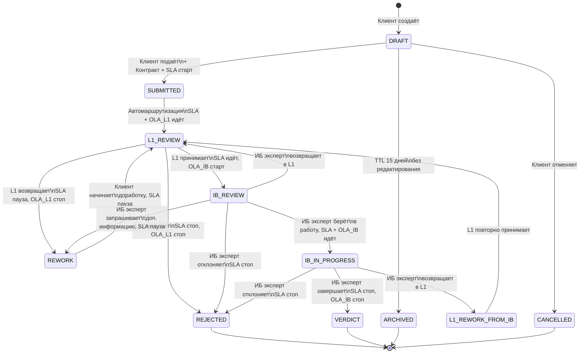
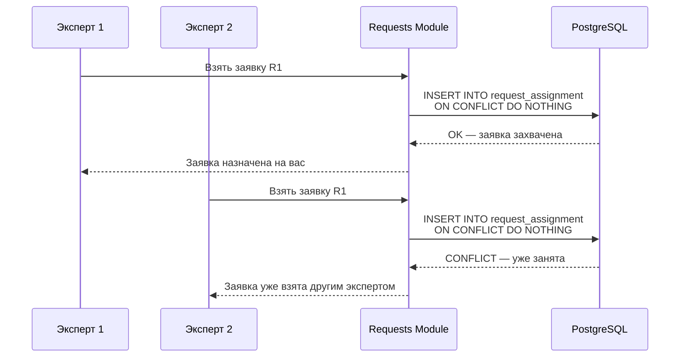

# Статусная модель и диаграммы Requests Module (текстовая расшифровка)

Ниже приведена расшифровка диаграмм с фото в текстовом виде.

Источник: wiki Requests Module (`bwiki.beeline.ru/spaces/CYB/pages/.../Requests+Module`).

---

## 4. Статусная модель (state machine)

### 4.1. Таблица статусов

На фото видны первые строки таблицы; остальные восстановлены по переходам на диаграмме.

| Статус | Описание | SLA | OLA L1 | OLA IB |
|---|---|---|---|---|
| **DRAFT** | Клиент заполняет данные | — | — | — |
| **ARCHIVED** | Черновик не редактировался 15 дней | — | — | — |
| **SUBMITTED** | Заявка подана. Контракт сформирован | ▶ Старт | — | — |
| **L1_REVIEW** | Заявка на проверке L1 | ▶ идёт | ▶ идёт | — |
| **REWORK** | Заявка возвращена на доработку (L1 или ИБ) | ⏸ пауза | ⏹ стоп | — |
| **IB_REVIEW** | Заявка в очереди ИБ | ▶ идёт | — | ▶ старт |
| **IB_IN_PROGRESS** | ИБ-эксперт взял заявку в работу | ▶ идёт | — | ▶ идёт |
| **L1_REWORK_FROM_IB** | ИБ вернул заявку на повторную проверку L1 | ▶ идёт | — | ⏹ стоп |
| **VERDICT** | ИБ завершил работу, вынесен вердикт | ⏹ стоп | — | ⏹ стоп |
| **REJECTED** | Заявка отклонена (L1 или ИБ) | ⏹ стоп | ⏹ стоп | ⏹ стоп |
| **CANCELLED** | Клиент отменил заявку | ⏹ стоп | — | — |

> Строки после SUBMITTED на фото обрезаны; колонки SLA / OLA восстановлены по подписям на стрелках переходов.

### 4.2. Переходы между статусами

#### Создание и черновик

| Из | В | Событие / условие |
|---|---|---|
| *(start)* | **DRAFT** | Клиент создаёт заявку |
| **DRAFT** | **SUBMITTED** | Клиент подаёт + формируется контракт + SLA старт |
| **DRAFT** | **ARCHIVED** | TTL 15 дней без редактирования |
| **DRAFT** | **CANCELLED** | Клиент отменяет |

#### Маршрутизация и L1

| Из | В | Событие / условие |
|---|---|---|
| **SUBMITTED** | **L1_REVIEW** | Автомаршрутизация. SLA + OLA_L1 идёт |
| **L1_REVIEW** | **REWORK** | L1 возвращает. SLA пауза. OLA_L1 стоп |
| **REWORK** | **L1_REVIEW** | Клиент начинает доработку. SLA пауза |
| **L1_REVIEW** | **REJECTED** | L1 отклоняет. SLA стоп. OLA_L1 стоп |
| **L1_REVIEW** | **IB_REVIEW** | L1 принимает. SLA идёт. OLA_IB старт |

#### ИБ-экспертиза

| Из | В | Событие / условие |
|---|---|---|
| **IB_REVIEW** | **IB_IN_PROGRESS** | ИБ эксперт берёт в работу. SLA + OLA_IB идёт |
| **IB_REVIEW** | **REWORK** | ИБ эксперт запрашивает доп. информацию. SLA пауза |
| **IB_REVIEW** | **REJECTED** | ИБ эксперт отклоняет. SLA стоп |
| **IB_REVIEW** | **L1_REVIEW** | ИБ эксперт возвращает в L1 |
| **IB_IN_PROGRESS** | **REJECTED** | ИБ эксперт отклоняет. SLA стоп |
| **IB_IN_PROGRESS** | **L1_REWORK_FROM_IB** | ИБ эксперт возвращает в L1 |
| **IB_IN_PROGRESS** | **VERDICT** | ИБ эксперт завершает работу. SLA стоп. OLA_IB стоп *(текст на фото частично обрезан)* |
| **L1_REWORK_FROM_IB** | **L1_REVIEW** | L1 повторно принимает |

#### Глобальные переходы

| Из | В | Событие / условие |
|---|---|---|
| *(активные статусы)* | **CANCELLED** | Клиент отменяет |
| **DRAFT** | **ARCHIVED** | TTL 15 дней без редактирования |

### 4.3. Mermaid — полная статусная модель

### 4.4. Упрощённый вид (фрагмент диаграммы)

На одном из фото показан упрощённый вариант, где возвраты L1 и запрос доп. информации от ИБ ведут сразу в **DRAFT**, а не через **REWORK**:

| Из | В | Событие / условие |
|---|---|---|
| **L1_REVIEW** | **DRAFT** | L1 возвращает. SLA пауза. OLA_L1 стоп |
| **L1_REVIEW** | **DRAFT** | Клиент начинает доработку. SLA пауза |
| **IB_IN_PROGRESS** | **DRAFT** | ИБ эксперт запрашивает доп. информацию. SLA пауза |
| **IB_IN_PROGRESS** | **L1_REVIEW** | L1 повторно принимает |
| **IB_IN_PROGRESS** | **L1_REVIEW** | ИБ эксперт возвращает в L1 |

> В полной модели (раздел 4.2) возвраты проходят через **REWORK** / **L1_REWORK_FROM_IB**. Упрощённый вид, вероятно, агрегирует «ожидание доработки» и «редактирование клиентом» в один статус **DRAFT**.

---

## 7.2. Диаграмма захвата заявки (sequence)

Сценарий: два ИБ-эксперта одновременно пытаются взять одну заявку **R1**. Конкурентность разрешается через уникальный индекс в `request_assignment` и `INSERT ... ON CONFLICT DO NOTHING`.

### Участники

| Участник | Роль |
|---|---|
| **Эксперт 1** | Первый ИБ-эксперт |
| **Эксперт 2** | Второй ИБ-эксперт |
| **Requests Module** | Сервис заявок |
| **PostgreSQL** | БД |

### Последовательность

| # | От | К | Сообщение |
|---|---|---|---|
| 1 | Эксперт 1 | Requests Module | Взять заявку R1 |
| 2 | Requests Module | PostgreSQL | `INSERT INTO request_assignment ON CONFLICT DO NOTHING` |
| 3 | PostgreSQL | Requests Module | OK — заявка захвачена |
| 4 | Requests Module | Эксперт 1 | Заявка назначена на вас |
| 5 | Эксперт 2 | Requests Module | Взять заявку R1 |
| 6 | Requests Module | PostgreSQL | `INSERT INTO request_assignment ON CONFLICT DO NOTHING` |
| 7 | PostgreSQL | Requests Module | CONFLICT — уже занята |
| 8 | Requests Module | Эксперт 2 | Заявка уже взята другим экспертом |

### Mermaid — sequence diagram

### Связь с ER-моделью

Таблица `REQUEST_ASSIGNMENT` (см. `requests-er-diagram.md`):

| Поле | Назначение |
|---|---|
| `request_id` | Заявка, которую захватывают |
| `expert_id` | Эксперт-исполнитель |
| `role` | Роль эксперта (L1 / IB) |
| `assigned_at` | Момент захвата |
| `released_at` | Момент освобождения (NULL = активное назначение) |

Уникальный индекс по `(request_id, role)` *(или аналогичный)* гарантирует, что только один эксперт может захватить заявку на данной роли.

---

## 8. API (фрагмент с фото)

На фото ниже диаграммы 7.2 начинается раздел **8. API**:

- **8.1. Клиентский API** — упоминается endpoint `POST /api/v1/requests` (остальное на фото не видно).
